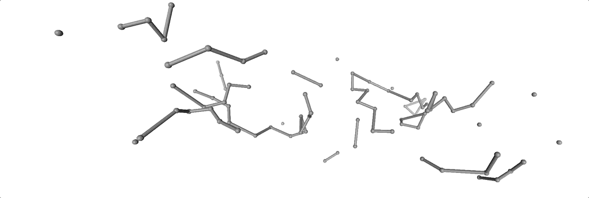

# Dent Disease

This work aims to understand what is *'wrong'* with the mutated protein, i.e. to understand the proteins' distribution with respect to the molecules in the **Dent disease**.

We need a way of comparing movements among the different molecular simulations. In order to discover how mutated protein differs from the non-mutated one.

 As we can see below nothing can be appreciated from the complete system *(membrane, waters, ions and the protein)*. Hence, how can we compare proteins? 

### Simplified Trajectory and Structure

As it is difficult to see the protein in this system, we simplify trajectory erasing membranes, waters and sodium ions. 

After that we only select the most important **Coordination Chlorines** as well as  **Proton Pathway**:

+ *Upper* chlorine: Gly209, Lys210, Glu211, Gly453, Leu454, Phe455, Ile456, Gly169, Ile170
+ *Lower* chlorine: Lys210, Glu211, Ser168, His561
+ *Proton* pathway:  Lys174, Glu211, Phe255, Gly260, Phe264, Glu267, Glu268, Ser520, Tyr558

Then, we obtained a clearer image of the protein trajectory along the simulation, which is primordial for the study of it.

## Kernel Principal Component Analysis

The data was structured as follows in a 3-Dimensional Matrix:

Once we have structured our data-base, we started computing different correlation matrices frame to frame based on **Root Mean Square Deviation** (RMSD) of atomic positions:

 $RMSD(v,w):=\sqrt{\frac{1}{n}\sum_{i=1}^{N}\|v_i-w_i\|^2} \ \ \ \textrm{Angstrom units}$  

The resulting matrix is known as the **Kernel Matrix**, however, a subtle change has been introduced: we changed distance to similarity measure, hence, a similarity of 1 means exactly the same position between frames and similarity of 0 means maximum distance among every frame.

From this matrix, we calculated the Principal Component Analysis so that we can see the evolution of the frames by means of the two most important components.

### Alpha carbons

As previously explained, the first step to follow is to select the desired atoms: **alpha carbons**. Which simplifies a lot the representation: 

* No-mutated protein: alpha carbons

* Mutated protein: alpha carbons

The **Kernel Matrices**, or correlation matrices, obtained for the mutated and non-mutated protein based on alpha carbons are:

From these heat maps, we could conclude that there is a recursive pattern of square shape along the diagonal. Another interesting property is that closer frames appear to be more similar than further frames in no-mutated protein, but slighltly differs in mutated protein.

Finally, we used these matrices to compute the **Principal Component Analysis**. Then, we projected both matrices to the two most important components in the same space.

